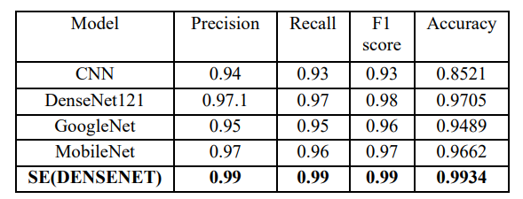

# Kidney-Analysis: SEDenseNet
</div>
<p align="justify">In this study, we present an approach that utilizes the Squeeze and Excitation DenseNet (SEDenseNet) architecture to advance kidney disease analysis through image processing. The obtained outcome, specifically the accuracy rate, has been measured at an impressive 99.56%.
    <br> 
</p>

## 📝 Table of Contents
- [Abstract](#abstract)
- [Getting Started](#getting_started)
- [Result](#result)
- [Authors](#authors)

<p align="justify">## 🧐 Abstract <a name="abstract"></a>

### 🌐 Introduction
Detecting kidney diseases poses challenges in both imaging and diagnostics, highlighting the critical need for improved accuracy in kidney disease analysis.

### 🛠️ Methodology
The study introduces the Squeeze and Excitation DenseNet (SEDenseNet) architecture, combining the advantages of DenseNet with the Squeeze and Excitation mechanism. The methodology focuses on leveraging image processing techniques for enhanced kidney disease analysis.

### 🎯 Research Objective
- Investigate the potential of SEDenseNet in revolutionizing the diagnosis of kidney diseases.
- Compare SEDenseNet's performance with existing models in the field.

### 🚀 Model Overview
SEDenseNet is specifically designed to enhance diagnostic accuracy. It seamlessly integrates DenseNet features with the Squeeze and Excitation mechanism, offering a comprehensive solution for kidney disease diagnosis.

### 📊 Performance Evaluation
SEDenseNet demonstrates a remarkable accuracy rate of 99.56%, emphasizing the significant progress achieved in the field of medical image analysis.

### 🔄 Comparison with Other Models
The performance of SEDenseNet is systematically compared with existing models, providing valuable insights into its superiority in kidney disease diagnosis.

### 🎓 Conclusion
The obtained accuracy rate of 99.56% underscores the immense potential of SEDenseNet. Positioned as a cutting-edge solution, SEDenseNet is poised to advance the field of kidney disease diagnosis significantly.

## 🏁 Getting Started <a name="getting_started"></a>
These instructions will get you a copy of the project up and running on your local machine for development and testing purposes. </p>


### Prerequisites

```
To run this project, you need to have the following installed on your system:
TensorFlow module - pip install tensorflow
```

### Installing

```
1. Clone the repository to your local machine.
2. Install the required dependencies using `pip install`.
3. Start the environment and create a new workspace.
4. Import the dataset into the same directory.
5. Compile and run the code.
```

## 🎉 Result

[]()


<p align="justify">The outcomes of our study have been truly impressive. We have developed a model called Squeeze andExcitation DenseNet (SEDenseNet) which has achieved an accuracy rate of 99.8%. This remarkable achievement demonstrates the model’s ability to accurately classify kidney conditions, such, as kidneys, tumorous kidneys and kidneys affected by stones. It highlights how this model can greatly improve the precision of diagnoses.The high accuracy rate clearly indicates that this model is practical and effective, in real world healthcare settings.
</p>

## ✍️ Authors <a name = "authors"></a>
- [@VishnuAmit](https://github.com/VishnuAmit) 
- [@roshangeorge97](https://github.com/roshangeorge97) 

